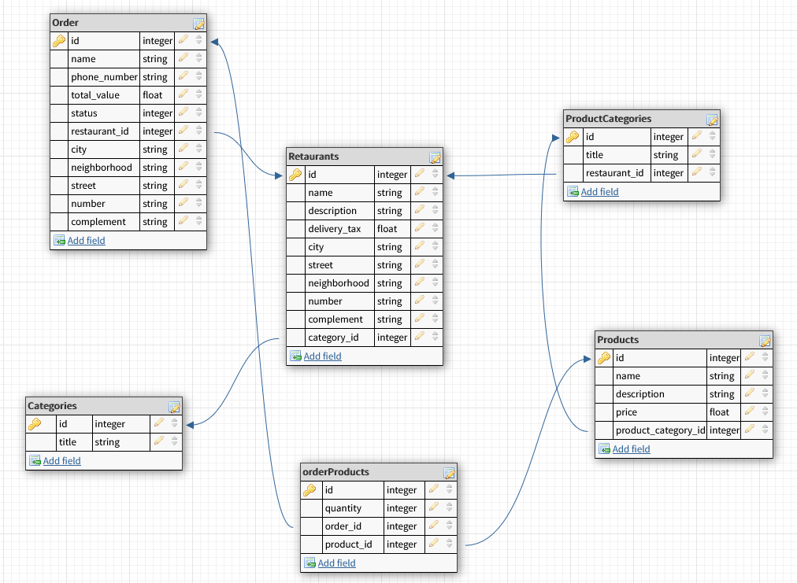

# Food delivery app

MVP application inspired on [IFood](https://www.ifood.com.br/) built with Ruby On Rails and NextJs

## How to Run

### On Local:

#### Pre Requirements

- [Ruby 3.0.0](https://www.ruby-lang.org/en/news/2020/12/25/ruby-3-0-0-released/)
- [Rails 6.0.3.3](https://rubygems.org/gems/rails/versions/6.0.3.3)
- [Node 15.0.1](https://nodejs.org/en/blog/release/v15.0.1)
- [SQLite](https://www.sqlite.org/index.html)

- API
  1. Install the dependencies:
  ```bash
  bundle install
  ```

  2. Setup the database:
  ```bash
  rails db:prepare
  ```

   - ***Optionally*** you can seed the database:
    ```bash
    rails db:seed
    ```

  3. Run the application:
  ```bash
  rails s
  ```

  4. Access the API on http://localhost:3000/api

- Client
  1. Install the dependencies:
  ```bash
  npm/yarn install
  ```
  2. Run the aplication:
   ```bash
  yarn/npm dev
  ```
    or build and run:
     ```bash
  yarn/npm build
  yarn/npm run
  ```
  3. Access the API on http://localhost:3001

### Database Schema



## Built with:

* [Ruby on Rails](http://www.dropwizard.io/1.0.2/docs/) - The Ruby on Rails framework for API

* [Next.js](https://github.com/vercel/next.js/) - Next.js is a flexible React framework that gives you building blocks to create fast web applications.

* [JBuilder](https://github.com/rails/jbuilder/blob/master/README.md) - JSON structures that beats manipulating giant hash structures

* [Rack-cors](https://github.com/cyu/rack-cors) - Rack Middleware for handling Cross-Origin Resource Sharing (CORS)

* [Ransack](https://github.com/activerecord-hackery/ransack) - Ransack will help you easily add searching to your Rails application, without any additional dependencies

* [Bootstrap](https://github.com/twbs/bootstrap) - The most popular HTML, CSS, and JavaScript framework for developing responsive, mobile first projects on the web.

* [Recoil](https://github.com/facebookexperimental/Recoil) - Recoil is an experimental state management library for React apps. It provides several capabilities that are difficult to achieve with React alone, while being compatible with the newest features of React.

* [React Icons](https://github.com/react-icons/react-icons) - Include popular icons in your React projects easily with react-icons, which utilizes ES6 imports that allows you to include only the icons that your project is using.

* [Sass](https://github.com/sass/sass) - Sass is an extension of CSS, adding nested rules, variables, mixins, selector inheritance, and more. It's translated to well-formatted, standard CSS using the command line tool or a plugin for your build system.

* [SWR](https://github.com/vercel/swr) - SWR is a React Hooks library for data fetching.

* [React slick](https://github.com/akiran/react-slick) - Carousel component built with React. It is a react port of [slick carousel](http://kenwheeler.github.io/slick/)
